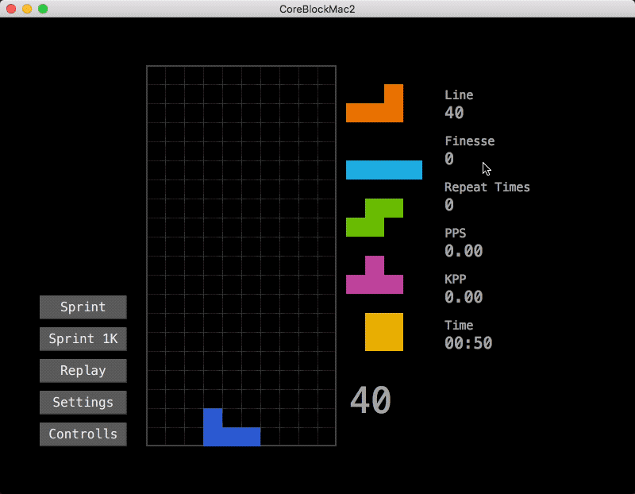

# Core Block Mac 2

Tetris clone in Mac, a rewrite of [simonlc/tetr.js](https://github.com/simonlc/tetr.js) using Swift, with [finesse](https://tetris.wiki/2_step_finesse) practice function.

[简体中文](README.zh.md)

## Requirements

- Deployment Target
  - Mac OS X 10.11+
- Build
  - Xcode 10.0+
  - Swift 4.2+

## Features

- Finesse practice function
- Tetris Guideline compliant (random bag, SRS, hold...)

- DAS, ARR settings
- Configurable controls

## Usage

### Default Controls

- Move left: J
- Move Right: L
- Soft Drop: K
- Hard Drop: I
- Rotate Left: D
- Rotate Right: F
- Rotate 180: S
- Hold: Space
- Pause: Q
- Retry: R
- Stop Repeat: W

### How to Practice Finesse

Edit the number of "Settings -> FinesseFaultRepeat". If greater than 0, after a finesse fault the current piece will go back to top. You should place it with finesse again and again until it reaches your specified number.

And you can stop the loop manually by "Stop Repeat" key.

## Open Source Licenses

- simonlc/tetr.js: [MIT](https://github.com/simonlc/tetr.js/blob/master/LICENSE)
- SnapKit/SnapKit: [MIT](https://github.com/SnapKit/SnapKit/blob/develop/LICENSE)

### License

Core Block Mac 2 is licensed under MIT License.

