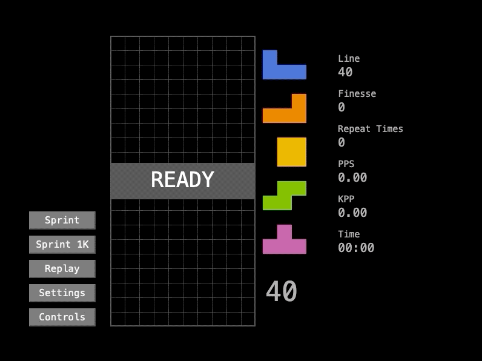

# Core Block Mac 2

Tetris clone in Mac, a rewrite of [simonlc/tetr.js](https://github.com/simonlc/tetr.js) using Swift, added [finesse](https://tetris.wiki/2_step_finesse) practice feature. I mainly use it to learn finesse.

[Click here to download release](https://github.com/aktue/Core-Block-Mac-2/releases).

## Requirements

- Deployment Target
  - Mac OS X 10.12+
- Build
  - Xcode 10.0+
  - Swift 4.2+

## Features

- Finesse practice
- Tetris Guideline compliant (random bag, SRS, hold...)

- DAS, ARR settings
- Configurable controls

## Usage

### Default Controls

- Move left: J
- Move Right: L
- Soft Drop: K
- Hard Drop: I
- Rotate Left: D
- Rotate Right: F
- Rotate 180: S
- Hold: Space
- Pause: Q
- Retry: R
- Stop Repeat: W

### How to Practice Finesse

After finesse fault, current piece will go back to top. You need to place it with correct finesse repeatedly until it reaches the times specified.

Change "Repeat Times" in "Settings -> FinesseFaultRepeat", set zero to turn off.

You can stop it manually by press "Stop Repeat" key.

## Open Source Licenses

- simonlc/tetr.js: [MIT](https://github.com/simonlc/tetr.js/blob/master/LICENSE)
- SnapKit/SnapKit: [MIT](https://github.com/SnapKit/SnapKit/blob/develop/LICENSE)

### License

Core Block Mac 2 is licensed under MIT License.

